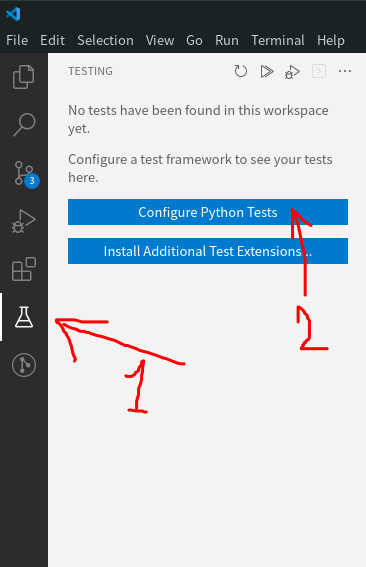
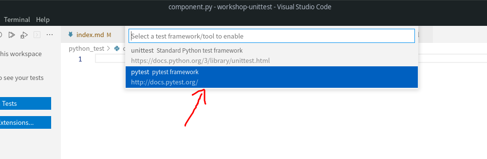
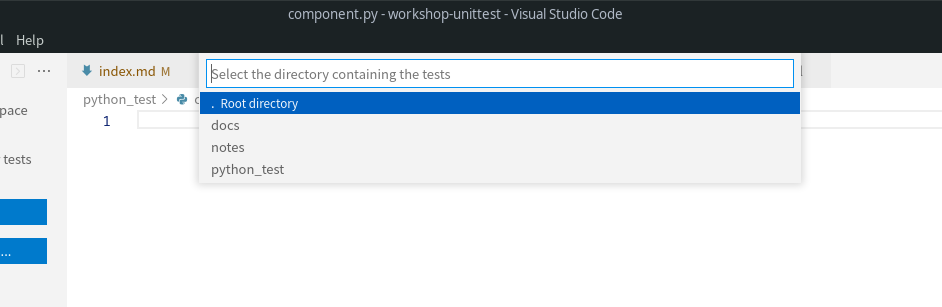
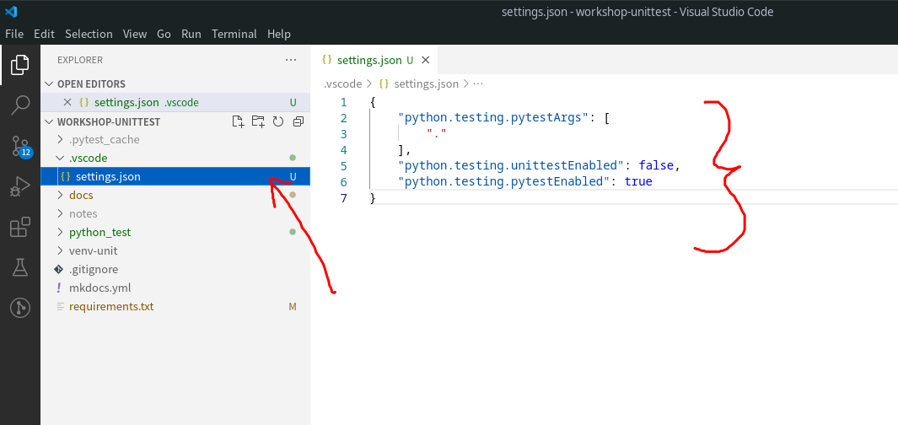
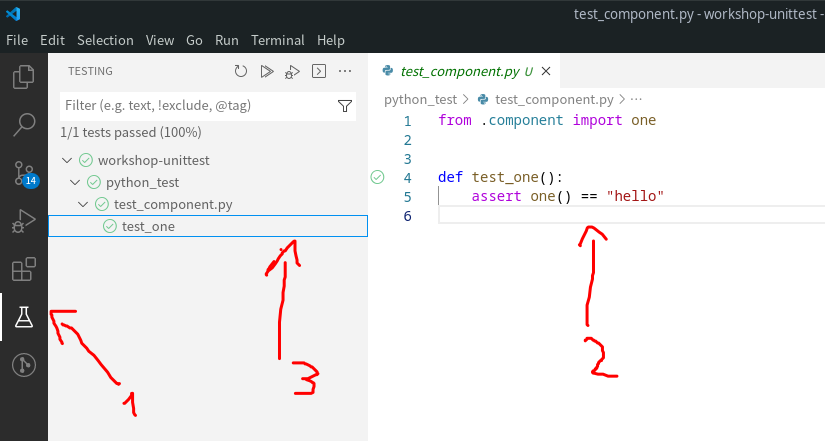

# About Unittest

## Introduction to Pytest

The pytest framework makes it easy to write small, readable tests, and can scale to support complex functional testing for applications and libraries.

## Set up your development environment
1. Install or update vscode, with the python extension
2. Set up and start your virtual environment
3. Install the necessary libraries
      * `pip install pytest`
      * `pip install pytest-cov`

4. Go to testing option and configure Python tests

    

5. Choose pytest and root directory

    
    

6. The `.vscode` folder will be automatically updated or created along with the `settings.json` file

    

7. If everything was done well and there is already at least one test, it will look like this

    

## Test and coverage

the coverage indicates the number of lines tested

### Basic commands of pytest

```
Structure of command:

pytest [options] [file_or_dir]
```

```
Run and show in terminal
    ▶ pytest --cov
    ▶ pytest --cov=python_test python_test

Run and show in xml
    ▶ pytest python_test -rA --junit-xml=report_test/report-unit-test.xml

Run with coverage and report html
    ▶ pytest --cov=python_test --cov-report=xml python_test
    ▶ pytest --cov=python_test --cov-report=html python_test
```
