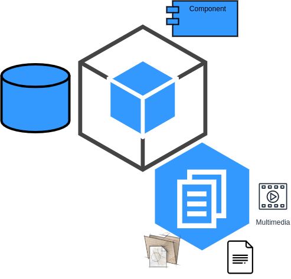
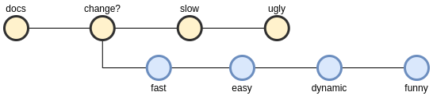
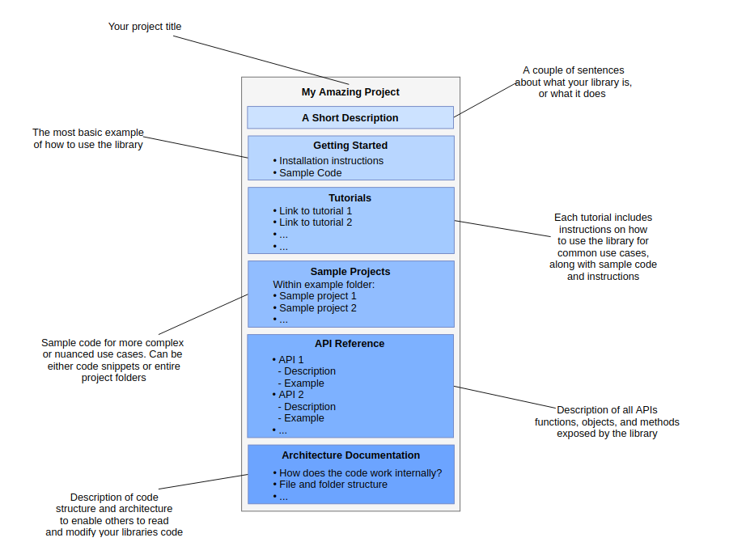

# About documentation

## Docs in software
- What is it?
```
(know him, Handle it) = set_of_elements(manuals, guides, videos, diagrams, Kwargs**)
```


- It is part of the project

    70% of the time reading

    Speak for itself
    
    Is the face to the community

- Documentation as code

    


- Influences quality

    More quality

    Good code **vs** bad documentation

## How to Write Good Documentation

[Article](https://www.sohamkamani.com/blog/how-to-write-good-documentation/)


## Read the docs

### where is it?

* Readme of project
* Wiki of project
* Inside the code
* Cloud folder: Drive(Docs, Calc, diagrams, ...)
* Courses, people, etc...
* [Read the docs](https://docs.readthedocs.io/en/stable/index.html)

### What is it?

> Technical documentation lives here

> Read the Docs simplifies software documentation by automating building, versioning, and hosting of your docs for you.

### Tools

- Sphinx
- MkDocs

> [tools for everything](https://www.sphinx-doc.org/en/master/examples.html)