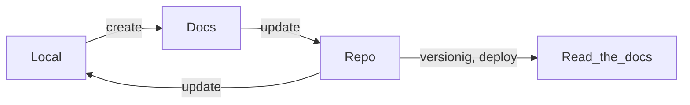

# MkDocs

Language: Markdown

## 1. Install

Assuming you have Python already, install MkDocs:

```sh
pip install mkdocs
```

Setup your MkDocs project:

```sh
mkdocs new .
```

## 2. Visualize

Gaming server:

```sh
mkdocs serve
```

## 3. Create

- New file
- New elements of markdown

## 4. Update

- [Install theme](https://github.com/squidfunk/mkdocs-material)
- [Install plugin](https://github.com/fralau/mkdocs-mermaid2-plugin)

## 5. Build

```sh
mkdocs build
```

## 6. Deploy

1. In some server  
2. In read the docs
3. Inside the project

## Flow

