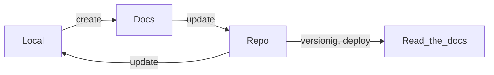

# Sphinx

Language: Markdown, reStructuredText

## 1. Install

Assuming you have Python already, install Sphinx:

```sh
pip install sphinx
```

Run sphinx-quickstart in there:

```sh
sphinx-quickstart
```

## 2. Visualize

Make html and view in navigator:

```sh
make html
```

## 3. Create

- New file
- New elements of markdown

## 4. Update

- [Install theme](https://github.com/readthedocs/sphinx_rtd_theme)
- Install plugin
    - [mermaid](https://github.com/mgaitan/sphinxcontrib-mermaid)
    - [recommonmark](https://recommonmark.readthedocs.io/en/latest/)

## 5. Build

```sh
make html
```

## 6. Deploy

1. In some server  
2. In read the docs

## Flow

